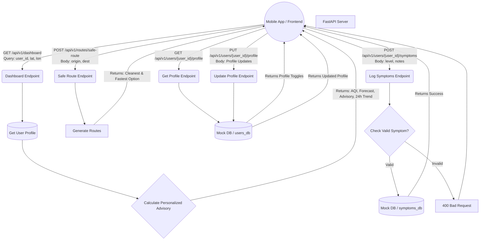

# API Routes Overview

This document highlights the endpoints and logical flows inside the Predictive AQI & Health Advisory Platform.

```mermaid
graph TD
    Client((Mobile App / Frontend))
    API[FastAPI Server]
    
    %% Dashboard
    Client -- "GET /api/v1/dashboard\nQuery: user_id, lat, lon" --> DashboardEndpoint(Dashboard Endpoint)
    DashboardEndpoint --> FetchProfile[(Get User Profile)]
    FetchProfile --> CalcAdvisory{Calculate Personalized Advisory}
    CalcAdvisory -- "Returns: AQI, Forecast, Advisory, 24h Trend" --> Client
    
    %% Safe Route
    Client -- "POST /api/v1/routes/safe-route\nBody: origin, dest" --> SafeRouteEndpoint(Safe Route Endpoint)
    SafeRouteEndpoint --> GenerateRoutes[Generate Routes]
    GenerateRoutes -- "Returns: Cleanest & Fastest Option" --> Client
    
    %% User Profile
    Client -- "GET /api/v1/users/{user_id}/profile" --> GetProfileEndpoint(Get Profile Endpoint)
    GetProfileEndpoint --> DB_Profile[(Mock DB / users_db)]
    DB_Profile -- "Returns Profile Toggles" --> Client
    
    Client -- "PUT /api/v1/users/{user_id}/profile\nBody: Profile Updates" --> UpdateProfileEndpoint(Update Profile Endpoint)
    UpdateProfileEndpoint --> DB_Profile
    DB_Profile -- "Returns Updated Profile" --> Client
    
    %% Symptoms
    Client -- "POST /api/v1/users/{user_id}/symptoms\nBody: level, notes" --> LogSymptomsEndpoint(Log Symptoms Endpoint)
    LogSymptomsEndpoint --> ValidateSymptom{Check Valid Symptom?}
    ValidateSymptom -- "Valid" --> DB_Symptoms[(Mock DB / symptoms_db)]
    ValidateSymptom -- "Invalid" --> Error400[400 Bad Request]
    DB_Symptoms -- "Returns Success" --> Client
    Error400 --> Client
```
